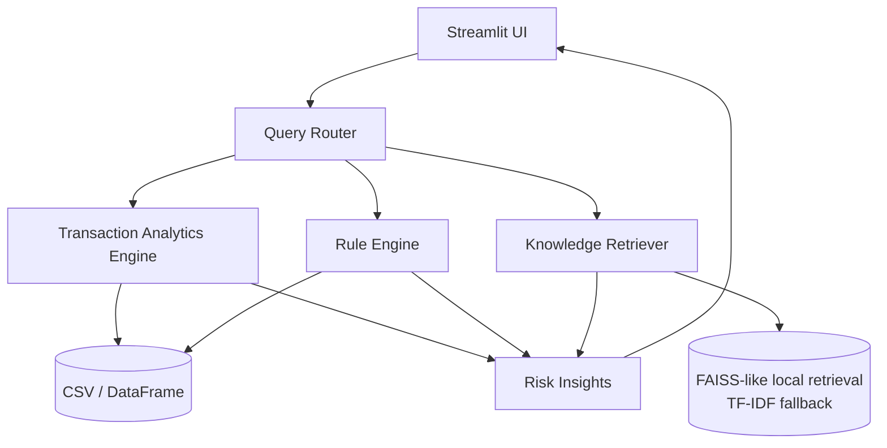

# AI Financial Risk & Payments Intelligence Platform

A GitHub-ready portfolio project that shows how an AI assistant can help payments, fraud, and risk teams investigate transactions, surface patterns, and explain likely causes of risk events.

This project is **not just a chatbot**. It combines:

- retrieval over payment/risk knowledge
- transaction analytics
- simple anomaly scoring
- rule-based risk explanations
- a Streamlit decision-support UI

It is designed to be a strong portfolio piece for roles spanning:

- AI Product Manager
- Payments Product Manager
- Risk / Fraud Product Owner
- Techno-functional PM / BA

---

## What it does

The app lets a user:

1. Upload or use a sample transaction dataset
2. Filter and analyze transactions by rail, status, risk level, and date
3. Investigate a specific transaction ID
4. Ask natural-language questions like:
   - `Why was transaction TXN-10015 flagged?`
   - `Show ACH failures in the last 7 days`
   - `What are the top risk patterns today?`
   - `Which payment rail has the highest failure rate?`
5. Review analyst-friendly explanations generated from:
   - transaction data
   - a lightweight rule engine
   - a knowledge base of payments/risk concepts

---

## Product positioning

Think of this as:

**“ChatGPT + fraud analyst workbench + payments operations dashboard”**

Instead of returning generic answers, it retrieves context and performs data analysis before responding.

---

## Architecture



### Main layers

- **UI layer**: Streamlit app for investigation and analytics
- **Analytics layer**: pandas-based profiling, aggregation, failure analysis, anomaly heuristics
- **Rules layer**: configurable risk rules such as amount thresholds, geo mismatch, failed retries, and velocity signals
- **Retrieval layer**: local retrieval over a built-in payments/risk knowledge base
- **Explanation layer**: combines analytics + rules + retrieved context into an analyst-ready answer

---

## Repo structure

```text
ai_fin_risk_repo/
├── app.py
├── requirements.txt
├── .gitignore
├── .env.example
├── README.md
├── .streamlit/
│   └── config.toml
├── data/
│   └── sample/
│       └── sample_transactions.csv
└── src/
    ├── __init__.py
    ├── config.py
    ├── data_loader.py
    ├── knowledge_base.py
    ├── retriever.py
    ├── rules_engine.py
    ├── analytics.py
    ├── explainer.py
    └── query_engine.py
```

---

## Quick start

### 1) Create a virtual environment

#### Windows PowerShell
```powershell
python -m venv .venv
.\.venv\Scripts\Activate.ps1
```

#### macOS / Linux
```bash
python3 -m venv .venv
source .venv/bin/activate
```

### 2) Install dependencies

```bash
pip install -r requirements.txt
```

### 3) Run the app

```bash
streamlit run app.py
```

---

## Sample data schema

The sample dataset includes the following columns:

- `transaction_id`
- `timestamp`
- `customer_id`
- `payment_rail` (ACH, WIRE, CARD, RTP)
- `direction` (DEBIT / CREDIT)
- `amount`
- `currency`
- `origin_country`
- `destination_country`
- `merchant_category`
- `channel`
- `device_id`
- `ip_address`
- `status`
- `failure_code`
- `is_fraud_label`
- `historical_customer_avg_amount`
- `customer_txn_count_24h`
- `beneficiary_change_flag`
- `geo_mismatch_flag`
- `velocity_flag`

---

## Example demo questions

Use these directly in the app:

- `Why was transaction TXN-10012 flagged?`
- `Show ACH failures`
- `Which payment rail has the highest failure rate?`
- `What are the top risk patterns in the data?`
- `Summarize wire transfer risks`
- `Explain geo mismatch risk`

---

## How the AI decision assistant works

When a user submits a question, the system:

1. Detects whether the question is about:
   - a specific transaction
   - failures
   - rail-level performance
   - risk patterns
   - general knowledge
2. Runs the relevant analytics
3. Applies rule-based risk checks
4. Retrieves related domain context from the knowledge base
5. Returns a concise explanation with evidence

---

## Suggested real datasets for future expansion

This repo includes a synthetic sample file so the app runs immediately.
For a stronger demo, connect it to larger public datasets such as:

- IEEE-CIS Fraud Detection
- PaySim mobile money dataset
- ULB credit card fraud dataset
- IBM AML simulated transactions

Add a note in your GitHub README or demo video explaining that the current repo is a portfolio-safe prototype with a built-in dataset and extensible ingestion layer.

---

## Portfolio talking points

This project demonstrates:

- product thinking for risk, fraud, and payments teams
- decision-support UX, not just conversational UX
- data-driven investigation workflows
- ability to connect payments domain knowledge with AI patterns
- techno-functional understanding across UI, APIs, rules, and analytics

---

## Resume bullets you can derive from this project

- Built an AI-powered payments risk intelligence prototype that combines transaction analytics, rule-based risk scoring, and retrieval-based knowledge assistance in a Streamlit investigation console.
- Designed analyst-facing workflows to explain failed payments, suspicious patterns, and rail-level risk trends across ACH, wires, cards, and RTP scenarios.
- Created a modular architecture for ingestion, analytics, rules evaluation, and explanation generation, making the platform extensible for fraud, compliance, and payments operations use cases.

---

## Future enhancements

- connect to PostgreSQL / Snowflake instead of CSV
- add embeddings + vector database
- integrate LLM APIs for richer narratives
- support case management and analyst notes
- add alert triage queue and SLA tracking
- add model monitoring for fraud score drift
- support ISO 20022 / SWIFT message parsing

---

## License

MIT
